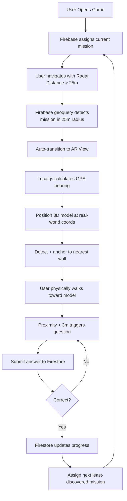
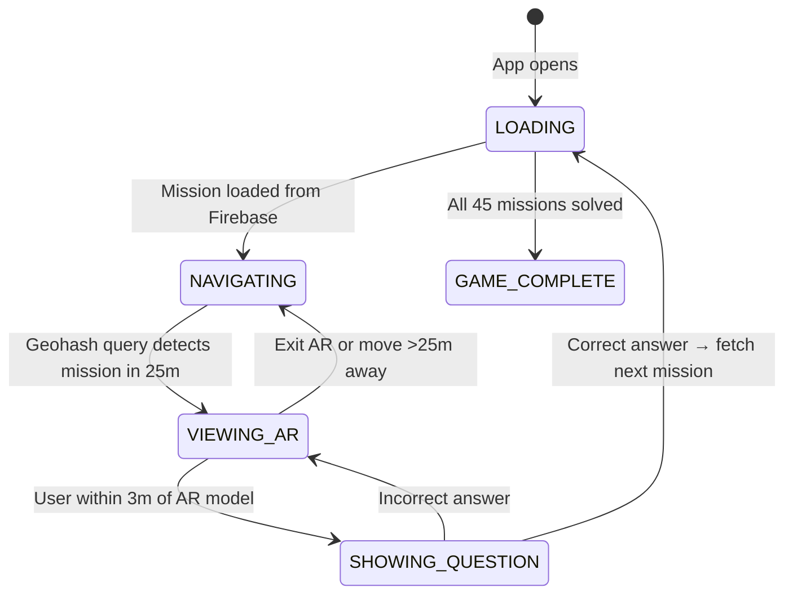

# Mirage (formerly TreasureHunt2.0)

**Mirage** is a campus-scale, location-aware AR scavenger hunt built on the TreasureHunt2.0 codebase. Players navigate to 45 missions across campus using GPS, discover AR clues anchored to real-world surfaces, and solve questions to progress. The game uses Firebase Firestore for real-time mission data, geohash-based proximity detection, and Locar.js for world-anchored AR rendering.

---

## Quick Summary

- **Project name**: Mirage (evolved from TreasureHunt2.0)
- **Frontend**: React 19 + Vite, React Three Fiber, Locar.js
- **Backend**: Firebase-centric (optional FastAPI for admin tools)
- **Database**: Firebase Firestore (missions, user progress, geohash indexes)
- **AR**: Locar.js for GPS + compass-based world anchoring (nearest wall detection)
- **Mission count**: 45 fixed campus locations
- **Distribution**: Least-discovered algorithm (balanced exploration)
- **Proximity detection**: Firebase geoqueries with geohash (25m radius, real-time)

---

## Core Features

### Gameplay Mechanics
- **45 Campus Missions**: Fixed pool of GPS-tagged locations across campus
- **Least-Discovered Distribution**: Algorithm assigns next mission from least-completed pool (prevents clustering)
- **Real-time Proximity Detection**: Firebase geoqueries with geohash automatically detect missions within 25m
- **World-Anchored AR**: Locar.js positions 3D models at GPS coordinates, anchored to nearest wall/surface
- **Progressive Unlocking**: Complete current mission to get next assignment
- **Score Tracking**: Real-time Firestore sync of user progress and leaderboard

### Technical Features
- **Geohash-based Geoqueries** (Firebase): No scan button needed, auto-detects nearby missions using geohash ranges
- **Continuous GPS Tracking**: Reuses `useGeolocation` hook from TreasureHunt2.0
- **Distance Calculation**: Haversine formula for accurate geodesic distance (reused from existing codebase)
- **Firebase Real-time Listeners**: Live updates for mission availability and user progress
- **Locar.js AR Rendering**: GPS + compass positioning, nearest-surface anchoring, proximity triggers
- **Radar Display**: Visual direction/distance indicator when navigating (>25m from target)
- **No Backend API Required**: Pure Firebase architecture (optional FastAPI for admin utilities only)

---

## Firebase Firestore Schema

### Mission Documents
**Collection**: `/missions/{missionId}`

```javascript
{
  "missionId": "mission_001",
  "lat": 30.3517,
  "lng": 76.3598,
  "geohash": "ttnf6e5k",  // Precision 8 for ~19m×19m cell
  "hint": "Near the bronze statue of the founder",
  "question": "What year is engraved on the plaque?",
  "correct_answer": "1923",
  "score_value": 15,
  "discovery_count": 42,
  "created_at": "2025-11-01T00:00:00Z"
}
```

**Index Required**: Composite index on `geohash` (ascending) + `discovery_count` (ascending)

### User Progress Documents
**Collection**: `/users/{userId}`

```javascript
{
  "userId": "user_abc123",
  "name": "Team Phoenix",
  "totalScore": 230,
  "solvedMissions": ["mission_001", "mission_003", "mission_007"],
  "currentMission": {
    "missionId": "mission_012",
    "hint": "Where the clock tower stands",
    "lat": 30.3520,
    "lng": 76.3602
  },
  "lastActive": "2025-11-08T14:22:00Z",
  "createdAt": "2025-11-06T09:00:00Z"
}
```

### GPS Activity Logs (Optional - for analytics)
**Collection**: `/gps_logs/{logId}`

```javascript
{
  "userId": "user_abc123",
  "missionId": "mission_001",
  "lat": 30.3518,
  "lng": 76.3599,
  "distance": 12.3,  // meters from target
  "timestamp": "2025-11-08T14:22:00Z",
  "action": "ar_viewed" | "answer_submitted"
}
```

---

## Geohash-Based Proximity Detection

### Why Geohash Instead of Scan Button?

**Previous Approach** (rejected): Manual "Scan Area" button → backend GPS validation → enable AR view

**New Approach** (adopted): Real-time Firebase geoqueries using geohash ranges

**Advantages**:

- ✅ **Serverless**: No FastAPI backend needed for proximity checks
- ✅ **Real-time**: Firebase listener auto-detects when user enters 25m radius
- ✅ **Efficient**: Geohash queries are indexed, O(log n) lookups
- ✅ **Scalable**: Firebase handles unlimited reads/writes (budget assumption confirmed)
- ✅ **UX**: Automatic state transitions, no manual button press
- ✅ **Simple**: Fewer moving parts, less code to maintain

### Implementation Details

**Geohash Precision for 25m Radius:**

- Precision 7: ±76m (too coarse)
- **Precision 8: ±19m** ← Use this (covers 25m radius with buffer)
- Precision 9: ±2.4m (too fine, misses edge cases)

**Firebase Query Pattern:**

```javascript
// src/firebase/missionQueries.js
import { collection, query, where, onSnapshot } from 'firebase/firestore';
import { geohashQueryBounds } from 'geofire-common';

export function subscribeToNearbyMissions(userLat, userLng, radius, callback) {
  const bounds = geohashQueryBounds([userLat, userLng], radius); // radius in meters
  
  const queries = bounds.map(([startHash, endHash]) => {
    return query(
      collection(db, 'missions'),
      where('geohash', '>=', startHash),
      where('geohash', '<=', endHash)
    );
  });
  
  // Subscribe to all range queries
  const unsubscribes = queries.map(q => 
    onSnapshot(q, snapshot => {
      const missions = [];
      snapshot.forEach(doc => {
        const mission = doc.data();
        // Client-side distance filter (geohash is approximate)
        const distance = getDistance(userLat, userLng, mission.lat, mission.lng);
        if (distance <= radius) {
          missions.push({ ...mission, distance });
        }
      });
      callback(missions);
    })
  );
  
  // Return unsubscribe function
  return () => unsubscribes.forEach(unsub => unsub());
}
```

**GameManager Integration:**

```javascript
// src/Pages/GameManager.jsx
const [nearbyMissions, setNearbyMissions] = useState([]);
const { location: userLocation } = useGeolocation();

useEffect(() => {
  if (!userLocation) return;
  
  const unsubscribe = subscribeToNearbyMissions(
    userLocation.latitude,
    userLocation.longitude,
    25, // 25 meter radius
    (missions) => {
      setNearbyMissions(missions);
      
      // Auto-transition to AR view if current mission is in range
      if (missions.some(m => m.missionId === currentMission?.missionId)) {
        setGameState('VIEWING_AR');
      }
    }
  );
  
  return () => unsubscribe();
}, [userLocation, currentMission]);
```

### No GPS Spoofing Concerns

**Risk Assessment**: GPS spoofing is **not a meaningful threat** for this use case

**Reasoning**:

1. **Knowledge Barrier**: To spoof GPS, player must already know mission coordinates
2. **Equivalent Effort**: If player has coordinates, walking there is easier than spoofing
3. **Campus Context**: Players are already on campus, physical presence is trivial
4. **Trust Model**: This is a fun scavenger hunt, not a high-stakes competition
5. **AR Validation**: Locar.js AR requires real compass/gyro data + camera feed (harder to fake)

**Decision**: Skip server-side GPS validation entirely. Pure client-side Firebase queries sufficient.

---

## Locar.js World-Anchored AR

### AR Flow (Revised without Scan Button)



### Locar.js Implementation

**Component**: `src/components/ARView/LocarARView.jsx`

```javascript
import React, { useEffect, useRef, useState } from 'react';
import { LocarScene, LocarObject } from '@locar/core';
import { useGLTF } from '@react-three/drei';
import { useGeolocation } from '../../hooks/useGeolocation';
import { getDistance } from '../../Views/utils/geo';

export default function LocarARView({ mission, onQuestionTrigger, onClose }) {
  const videoRef = useRef(null);
  const locarSceneRef = useRef(null);
  const [distanceToModel, setDistanceToModel] = useState(null);
  const [error, setError] = useState(null);
  const { location: deviceLocation } = useGeolocation();
  
  useEffect(() => {
    if (!deviceLocation || !mission) return;
    
    let stream;
    
    const initAR = async () => {
      try {
        // 1. Start camera
        stream = await navigator.mediaDevices.getUserMedia({
          video: { facingMode: 'environment' }
        });
        videoRef.current.srcObject = stream;
        await videoRef.current.play();
        
        // 2. Initialize Locar scene
        const locarScene = new LocarScene({
          videoElement: videoRef.current,
          deviceLocation: {
            lat: deviceLocation.latitude,
            lng: deviceLocation.longitude
          },
          enableCompass: true,
          enableGyroscope: true,
          surfaceDetection: true
        });
        
        // 3. Load 3D model
        const { scene: modelScene } = useGLTF('/assets/magnemite/scene.gltf');
        
        // 4. Create world-anchored AR object
        const arObject = new LocarObject({
          model: modelScene.clone(),
          position: {
            lat: mission.lat,
            lng: mission.lng,
            altitude: 1.5  // 1.5m above ground
          },
          scale: 0.5,
          anchorToSurface: 'nearest-wall',
          showDistanceIndicator: false
        });
        
        locarScene.addObject(arObject);
        
        // 5. Listen for device movement
        locarScene.on('deviceMove', (data) => {
          const dist = getDistance(
            data.deviceLat, data.deviceLng,
            mission.lat, mission.lng
          );
          setDistanceToModel(dist);
          
          // Trigger question when within 3 meters
          if (dist < 3) {
            onQuestionTrigger();
          }
        });
        
        locarSceneRef.current = locarScene;
        locarScene.start();
        
      } catch (err) {
        console.error('Locar AR init failed:', err);
        setError(`AR Error: ${err.message}`);
      }
    };
    
    initAR();
    
    // Cleanup
    return () => {
      if (locarSceneRef.current) {
        locarSceneRef.current.stop();
        locarSceneRef.current.dispose();
      }
      if (stream) {
        stream.getTracks().forEach(t => t.stop());
      }
    };
  }, [deviceLocation, mission, onQuestionTrigger]);
  
  return (
    <div className="locar-ar-container">
      <video 
        ref={videoRef}
        autoPlay
        playsInline
        muted
        style={{ width: '100%', height: '100vh', objectFit: 'cover' }}
      />
      
      {distanceToModel !== null && distanceToModel >= 3 && (
        <div className="ar-distance-overlay">
          <p>Walk toward the AR clue</p>
          <p className="distance">{distanceToModel.toFixed(1)}m away</p>
        </div>
      )}
      
      {error && <div className="ar-error">{error}</div>}
      
      <button onClick={onClose} className="close-ar-btn">
        Exit AR
      </button>
    </div>
  );
}
```

### Key Locar.js Features

1. **GPS-based Positioning**: Model placed at exact GPS coordinates
2. **Compass Orientation**: Device compass determines view direction
3. **Gyroscope Tracking**: Smooth camera movement as user rotates
4. **Nearest Wall Anchoring**: Automatically finds vertical surface within 5m
5. **Distance Calculation**: Real-time distance from device to AR object
6. **Proximity Triggers**: Event fired when user < 3m from target

---

## Architecture Overview (TreasureHunt2.0 → Mirage)

### What Changes?

| Component | TreasureHunt2.0 | Mirage | Change Type |
|-----------|-----------------|--------|-------------|
| **Database** | MongoDB (sequential questions) | Firebase Firestore (geohash-indexed missions) | Complete replacement |
| **Backend** | Express API (CRUD + validation) | None (pure Firebase) or optional FastAPI (admin only) | Removed/Simplified |
| **Mission Flow** | Sequential linked-list | Least-discovered algorithm | Logic overhaul |
| **Proximity Detection** | Client-side distance check | Firebase geoqueries (real-time) | Enhanced |
| **AR Rendering** | Three.js fixed overlay | Locar.js world-anchored | Complete rewrite |
| **State Machine** | `NAVIGATING → PROMPT_CAMERA → VIEWING_AR` | `NAVIGATING → VIEWING_AR (auto)` | Simplified |

### What Stays the Same?

| Component | File Path | Reuse Status |
|-----------|-----------|--------------|
| Geolocation Hook | `src/hooks/useGeolocation.js` | ✅ 100% reusable |
| Distance/Bearing Utils | `src/Views/utils/geo.js` | ✅ 100% reusable |
| Radar Display | `src/components/RadarDisplay/RadarDisplay.jsx` | ✅ Minor styling tweaks |
| Home Screen | `src/Views/Home.jsx` | ⚠️ Remove countdown, add score |
| Login/Signup | `src/Views/Login.jsx`, `Signup.jsx` | ⚠️ Switch to Firebase Auth |
| Admin UI | `src/Pages/Admin.jsx` | ⚠️ Rewrite for Firestore CRUD |
| App Router | `src/App.jsx` | ✅ Routes stay the same |

### New Components Needed

```
src/
├── components/
│   ├── ARView/
│   │   └── LocarARView.jsx          ← NEW: Locar.js AR rendering
│   ├── QuestionPopup/
│   │   └── QuestionPopup.jsx        ← Modified: Firestore submit
│   └── ScoreDisplay/
│       └── ScoreDisplay.jsx         ← NEW: Real-time score widget
├── firebase/
│   ├── config.js                    ← NEW: Firebase init
│   ├── auth.js                      ← NEW: Firebase Auth helpers
│   ├── missionQueries.js            ← NEW: Geohash proximity queries
│   └── userProgress.js              ← NEW: Progress CRUD operations
└── hooks/
    ├── useFirestoreMissions.js      ← NEW: Real-time mission listener
    └── useUserProgress.js           ← NEW: User progress hook
```

---

## Setup & Development

### Prerequisites

- Node.js 18+ and npm
- Firebase account with Firestore database
- Mobile device with GPS, compass, and camera (for testing AR)

### Installation Steps

#### 1. Frontend Setup

```bash
# Install dependencies
npm install

# Add new dependencies for Mirage
npm install firebase geofire-common @locar/core @locar/three

# Create environment file
cp .env.example .env

# Add Firebase config to .env
# VITE_FIREBASE_API_KEY=your_api_key
# VITE_FIREBASE_AUTH_DOMAIN=your_auth_domain
# VITE_FIREBASE_PROJECT_ID=your_project_id
# VITE_FIREBASE_STORAGE_BUCKET=your_storage_bucket
# VITE_FIREBASE_MESSAGING_SENDER_ID=your_sender_id
# VITE_FIREBASE_APP_ID=your_app_id

# Run development server
npm run dev
```

#### 2. Firebase Setup

```bash
# Install Firebase CLI
npm install -g firebase-tools

# Login to Firebase
firebase login

# Initialize Firebase in project
firebase init firestore

# Deploy Firestore security rules
firebase deploy --only firestore:rules

# Deploy Firestore indexes
firebase deploy --only firestore:indexes
```

**Firestore Index Configuration** (`firestore.indexes.json`):

```json
{
  "indexes": [
    {
      "collectionGroup": "missions",
      "queryScope": "COLLECTION",
      "fields": [
        { "fieldPath": "geohash", "order": "ASCENDING" },
        { "fieldPath": "discovery_count", "order": "ASCENDING" }
      ]
    },
    {
      "collectionGroup": "missions",
      "queryScope": "COLLECTION",
      "fields": [
        { "fieldPath": "discovery_count", "order": "ASCENDING" }
      ]
    }
  ]
}
```

#### 3. Mission Data Upload

```javascript
// scripts/uploadMissions.js
import { initializeApp } from 'firebase/app';
import { getFirestore, collection, doc, setDoc } from 'firebase/firestore';
import { geohashForLocation } from 'geofire-common';
import missionData from './missions.json';

const app = initializeApp(firebaseConfig);
const db = getFirestore(app);

async function uploadMissions() {
  for (const mission of missionData) {
    const geohash = geohashForLocation([mission.lat, mission.lng], 8);
    
    await setDoc(doc(db, 'missions', mission.missionId), {
      ...mission,
      geohash,
      discovery_count: 0,
      created_at: new Date().toISOString()
    });
    
    console.log(`Uploaded: ${mission.missionId}`);
  }
}

uploadMissions().then(() => console.log('Done!'));
```

**Run upload**:

```bash
node scripts/uploadMissions.js
```

#### 4. Optional: Admin Tools (FastAPI)

Only needed if you want advanced analytics or admin dashboard.

```bash
cd backend
python -m venv .venv
source .venv/bin/activate  # On Windows: .venv\Scripts\activate
pip install -r requirements.txt

# Set Firebase service account
export GOOGLE_APPLICATION_CREDENTIALS=path/to/serviceAccountKey.json

# Run FastAPI server
uvicorn main:app --reload --port 8000
```

**backend/requirements.txt**:

```txt
fastapi==0.104.1
uvicorn[standard]==0.24.0
firebase-admin==6.2.0
pydantic==2.5.0
python-dotenv==1.0.0
```

### Package.json Updates

Add to existing `package.json`:

```json
{
  "dependencies": {
    "@locar/core": "^1.2.0",
    "@locar/three": "^1.2.0",
    "firebase": "^10.7.0",
    "geofire-common": "^6.0.0",
    "react-toastify": "^11.0.5"
  }
}
```

---

## Development Workflow

### Local Testing

1. **Desktop Development** (geolocation only):
   - Use browser DevTools to spoof GPS coordinates
   - AR features won't work (no compass/gyro)
   - Test mission distribution and Firebase queries

2. **Mobile Testing** (full AR):
   - Expose Vite dev server: `npm run dev -- --host`
   - Access via `https://your-local-ip:5173` on mobile
   - Enable location permissions and camera access
   - Test Locar.js AR and proximity triggers

### Deployment

**Frontend** (Vercel/Netlify):

```bash
# Build production bundle
npm run build

# Deploy to Vercel
vercel --prod

# Or deploy to Netlify
netlify deploy --prod --dir dist
```

**Firebase** (rules + indexes):

```bash
firebase deploy --only firestore
```

**Backend** (optional, Google Cloud Run):

```bash
cd backend
gcloud run deploy mirage-admin \
  --source . \
  --platform managed \
  --region us-central1 \
  --allow-unauthenticated
```

---

## Implementation Roadmap

### Phase 1: Firebase Foundation (Week 1)

- [ ] Create Firebase project and Firestore database
- [ ] Set up Firebase Auth (email/password)
- [ ] Create `missions` collection with 5 test missions
- [ ] Implement geohash-based proximity queries
- [ ] Test real-time listeners on desktop

### Phase 2: Core Gameplay (Week 2)

- [ ] Migrate `GameManager.jsx` to Firebase
- [ ] Remove scan button, add auto-transition logic
- [ ] Implement `useUserProgress` hook
- [ ] Build least-discovered mission algorithm
- [ ] Add QuestionPopup with Firestore submit

### Phase 3: AR Integration (Week 3)

- [ ] Install Locar.js dependencies
- [ ] Create `LocarARView.jsx` component
- [ ] Test GPS-based AR positioning on mobile
- [ ] Implement nearest-wall anchoring
- [ ] Add proximity trigger (<3m) for questions

### Phase 4: Polish & Testing (Week 4)

- [ ] Upload all 45 campus missions
- [ ] Build admin dashboard for mission management
- [ ] Comprehensive mobile testing
- [ ] Deploy to production (Vercel + Firebase)
- [ ] Load testing with multiple concurrent users

---

## Testing Notes

### Critical Testing Areas

1. **Geohash Precision**: Verify 25m radius detection at mission boundaries
2. **Mission Distribution**: Confirm least-discovered algorithm balances exploration
3. **AR Positioning**: Test Locar.js accuracy at various distances (5m, 10m, 20m)
4. **Wall Anchoring**: Verify models anchor to walls, not floors/ceilings
5. **Proximity Triggers**: Ensure question appears reliably at 3m threshold
6. **Firebase Listeners**: Test real-time updates when multiple users complete missions
7. **Offline Behavior**: Handle network interruptions gracefully

### Known Limitations

- **GPS Accuracy**: ±5-10m typical, may cause early AR triggers in dense buildings
- **Compass Drift**: Indoor compass can be unreliable, may need recalibration
- **Battery Usage**: Continuous GPS + camera drains battery quickly (~20% per hour)
- **Network Dependency**: Requires constant Firestore connection for real-time updates

---

## FAQ

**Q: Why remove the FastAPI backend?**  
A: Firebase handles all validation, storage, and real-time queries. Backend is unnecessary overhead for this use case.

**Q: What about GPS spoofing?**  
A: Not a concern. Players need mission coordinates to spoof, which means they could just walk there. AR requires real camera/compass data anyway.

**Q: Why geohash instead of server-side validation?**  
A: Geohash queries are O(log n), real-time, and Firebase-native. Server-side adds latency and complexity for no security benefit.

**Q: Can Locar.js work indoors?**  
A: Yes, but compass accuracy degrades near metal structures. Outdoor missions are more reliable.

**Q: How to prevent users from seeing all mission locations?**  
A: Firestore security rules only allow users to see their `currentMission`. Full mission list is admin-only.

---

## Next Steps

Ready to start implementation? Here's the recommended order:

1. **Set up Firebase project** → Create Firestore database + add 5 test missions
2. **Implement geohash queries** → Build `subscribeToNearbyMissions()` function
3. **Modify GameManager** → Add auto-transition logic for AR view
4. **Create LocarARView** → Test basic AR positioning on mobile
5. **Add mission distribution** → Implement least-discovered algorithm
6. **Upload 45 missions** → Populate Firestore with campus locations

Choose which component to scaffold first and we'll begin implementation!

## Mission Distribution Algorithm

### Least-Discovered Selection (Firebase Implementation)

**Goal**: Assign next mission from pool with lowest `discovery_count` to ensure balanced campus exploration.

**Implementation**:

```javascript
// src/firebase/missionDistribution.js
import { collection, query, where, orderBy, limit, getDocs } from 'firebase/firestore';

export async function getNextMission(userId) {
  // 1. Get user's solved missions
  const userRef = doc(db, 'users', userId);
  const userSnap = await getDoc(userRef);
  const solvedMissions = userSnap.data().solvedMissions || [];
  
  // 2. Query all missions ordered by discovery_count
  const missionsQuery = query(
    collection(db, 'missions'),
    orderBy('discovery_count', 'asc'),
    limit(50)  // Get top 50 least-discovered
  );
  
  const querySnapshot = await getDocs(missionsQuery);
  
  // 3. Filter out already solved
  const unsolved = [];
  querySnapshot.forEach(doc => {
    if (!solvedMissions.includes(doc.id)) {
      unsolved.push({ id: doc.id, ...doc.data() });
    }
  });
  
  if (unsolved.length === 0) {
    return null;  // All missions completed!
  }
  
  // 4. Find minimum discovery count
  const minCount = unsolved[0].discovery_count;
  
  // 5. Get all missions with same minimum count
  const leastDiscovered = unsolved.filter(m => m.discovery_count === minCount);
  
  // 6. Random selection if multiple have same count
  const selected = leastDiscovered[Math.floor(Math.random() * leastDiscovered.length)];
  
  // 7. Update user's current mission
  await updateDoc(userRef, {
    currentMission: {
      missionId: selected.id,
      hint: selected.hint,
      lat: selected.lat,
      lng: selected.lng
    }
  });
  
  return selected;
}
```

**When Called**:

- On user signup/first login
- After correctly answering a question
- If user manually requests a new mission (optional feature)

**Firestore Rules Required**:

```javascript
rules_version = '2';
service cloud.firestore {
  match /databases/{database}/documents {
    // Missions are publicly readable
    match /missions/{missionId} {
      allow read: if request.auth != null;
      allow write: if request.auth.token.admin == true;  // Admin only
    }
    
    // Users can read/write their own progress
    match /users/{userId} {
      allow read, write: if request.auth != null && request.auth.uid == userId;
    }
  }
}
```

---

## GameManager State Machine (Revised)

### State Flow



### Implementation

```javascript
// src/Pages/GameManager.jsx (modified)
import { useState, useEffect } from 'react';
import { useGeolocation } from '../hooks/useGeolocation';
import { subscribeToNearbyMissions } from '../firebase/missionQueries';
import { useUserProgress } from '../hooks/useUserProgress';
import RadarDisplay from '../components/RadarDisplay/RadarDisplay';
import LocarARView from '../components/ARView/LocarARView';
import QuestionPopup from '../components/QuestionPopup/QuestionPopup';

const GameManager = () => {
  const [gameState, setGameState] = useState('LOADING');
  const [nearbyMissions, setNearbyMissions] = useState([]);
  const [showQuestion, setShowQuestion] = useState(false);
  
  const { location } = useGeolocation();
  const { currentMission, updateProgress } = useUserProgress();
  
  // Subscribe to nearby missions (Firebase geohash queries)
  useEffect(() => {
    if (!location) return;
    
    const unsubscribe = subscribeToNearbyMissions(
      location.latitude,
      location.longitude,
      25,  // 25m radius
      (missions) => {
        setNearbyMissions(missions);
        
        // Auto-transition to AR if current mission is in range
        const currentInRange = missions.some(
          m => m.missionId === currentMission?.missionId
        );
        
        if (currentInRange && gameState === 'NAVIGATING') {
          setGameState('VIEWING_AR');
        } else if (!currentInRange && gameState === 'VIEWING_AR') {
          setGameState('NAVIGATING');
          setShowQuestion(false);
        }
      }
    );
    
    return () => unsubscribe();
  }, [location, currentMission, gameState]);
  
  // Locar proximity trigger (3m)
  const handleQuestionTrigger = () => {
    setShowQuestion(true);
  };
  
  const handleAnswerSubmit = async (answer) => {
    const correct = answer.toLowerCase().trim() === 
                    currentMission.correct_answer.toLowerCase().trim();
    
    if (correct) {
      await updateProgress(currentMission.missionId, currentMission.score_value);
      setGameState('LOADING');  // Triggers next mission fetch
      setShowQuestion(false);
    } else {
      // Show error toast, keep question open
      toast.error('Incorrect answer. Try again!');
    }
  };
  
  return (
    <div className="game-manager">
      {gameState === 'LOADING' && <LoadingIndicator />}
      
      {gameState === 'NAVIGATING' && currentMission && (
        <div>
          <h2>Current Mission</h2>
          <p className="hint">{currentMission.hint}</p>
          <RadarDisplay
            userLocation={location}
            targetLocation={{
              latitude: currentMission.lat,
              longitude: currentMission.lng
            }}
          />
        </div>
      )}
      
      {gameState === 'VIEWING_AR' && currentMission && (
        <LocarARView
          mission={currentMission}
          onQuestionTrigger={handleQuestionTrigger}
          onClose={() => setGameState('NAVIGATING')}
        />
      )}
      
      {showQuestion && currentMission && (
        <QuestionPopup
          question={currentMission.question}
          onSubmit={handleAnswerSubmit}
          onClose={() => setShowQuestion(false)}
        />
      )}
      
      {gameState === 'GAME_COMPLETE' && (
        <div className="completion-screen">
          <h1>Mission Complete!</h1>
          <p>You've discovered all 45 campus locations!</p>
        </div>
      )}
    </div>
  );
};
```

---

## Running notes & testing

- Test GPS flows on actual mobile devices (desktop geolocation can be spoofed via browser devtools but sensors/compass require mobile)
- Ensure HTTPS on production, required for getUserMedia and device sensors
- Rate-limit scan/submit endpoints to avoid abuse
- Log GPS scans for manual in-person verification

---

## Project status & next steps

- Current repository contains TreasureHunt2.0 full-stack React+Express+MongoDB app.
- Migration steps and component list are documented above.
- To start migration: create FastAPI backend skeleton, add Firebase config, implement `/scan/gps` then integrate LocarARView.

---

## Useful references (local file pointers)

- App entry: `src/App.jsx`
- Game manager: `src/Pages/GameManager.jsx`
- Geolocation hook: `src/hooks/useGeolocation.js`
- Radar: `src/components/RadarDisplay/RadarDisplay.jsx`
- Camera prompt: `src/components/CameraPrompt/CameraPrompt.jsx` (replace)
- Admin UI: `src/Pages/Admin.jsx`
- Existing backend: `Backend/` (reference only; will be replaced)

---

For implementation tasks (FastAPI endpoints, LocarARView component, Firebase scripts) supply which part to scaffold first and the project will be updated accordingly.